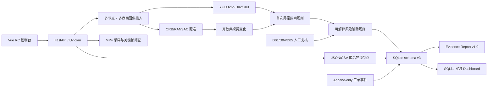

# 件证 Competition Release Candidate v1.0

## 发布结论

Competition MVP v0.2 已升级为可离线运行的 Competition RC v1.0。本版本保留原有 D02/D03 检测、开放集变化、ORB/RANSAC 配准、多节点多表面、指纹、人工复核、SQLite、FastAPI、Vue、报告和 Demo A-D，并补齐规则风险辅助、匿名物流节点、工单闭环、Dashboard、MP4 关键帧筛查和 Evidence Report v1.0。

发布状态以 `docs/goals/competition-rc-v1.0.md` 为唯一 Goal Tracker；所有结论必须以外部运行证据为准。

## 版本身份

| 项目 | 值 |
|---|---|
| Pipeline | `competition-rc-v1.0` |
| API | `1.0.0-rc.1` |
| Frontend | `1.0.0-rc.1` |
| SQLite schema | `3`（从 v2 additive-only 迁移） |
| Active model | `d02-d03-yolo26n-imgsz960-v0.1` |
| Model SHA-256 | `2dd857412b63df66d1273b326dc51afaed895da1d360c97e184762c882181a97` |
| Risk engine | `responsibility-risk-rules-v1.0` |
| Report | `evidence-report-v1.0` |
| Video capability | `VIDEO_DAMAGE_KEYFRAME_SCREENING` |

## 架构



## 构建与验证

```powershell
Set-Location 'E:\Artificial-intelegence-training'
powershell.exe -NoProfile -ExecutionPolicy Bypass -File .\scripts\demo\build-competition-release.ps1
powershell.exe -NoProfile -ExecutionPolicy Bypass -File .\scripts\demo\verify-competition-release.ps1
```

构建与现场运行不访问 GitHub、Roboflow、npm registry、PyPI 或外部 API。依赖、模型和 `node_modules` 必须在赛前安装完成。

## 已验证证据

- 全量测试：331/331 PASS，其中原有 255 项全部保留，新增 76 项。
- 真实 Uvicorn 全链路：PASS，含 health、model、warmup、案例、多表面上传、分析、复核、风险、工单、Dashboard、报告、MP4、前端。
- 稳定性：3/3 完整独立启动/停止循环 PASS。
- 性能：cold 4097.121 ms；warm×5 中位数 940.674 ms。
- SYSTEM BEHAVIOR VALIDATION：17/17 PASS（不是模型 accuracy）。
- 主 Demo 自动化实测：1.943 秒，小于 180 秒目标。

## 外部证据路径

- `E:\JianZhengData\runtime\competition-rc-v1.0\competition-e2e-v1.0.json`
- `E:\JianZhengData\runtime\competition-rc-v1.0\competition-release-stability-v1.0.json`
- `E:\JianZhengData\runtime\competition-rc-v1.0\performance-v1.0.json`
- `E:\JianZhengData\runtime\competition-rc-v1.0\demo-duration-v1.0.json`
- `E:\JianZhengData\runtime\competition-validation-v1.0\competition-validation-summary-v1.0.json`
- `E:\JianZhengData\runtime\competition-rc-v1.0\release\competition-release-manifest-v1.0.json`

## 固定边界

本版本不提供真实快递企业 API、视频行为识别、用户账号/OAuth、云端部署、D01/D04/D05 自动分类或法律责任自动认定。真实连续物流序列校准状态为 `PENDING_EXTERNAL_DATA`。
