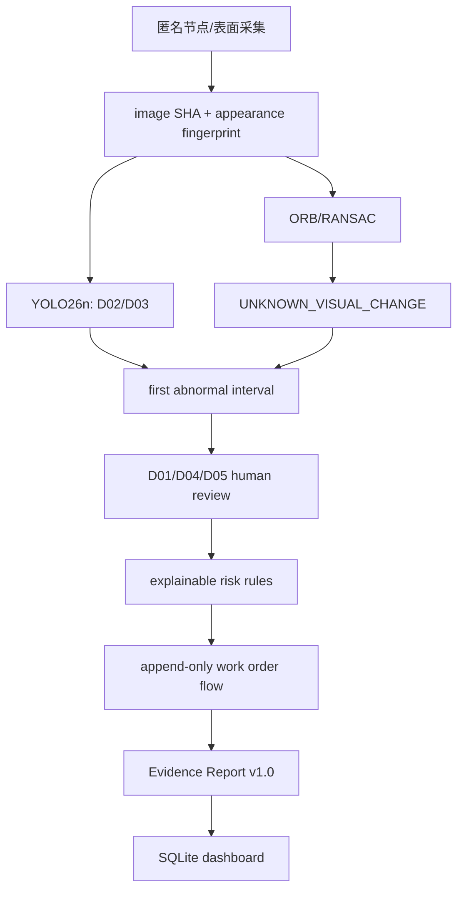

# Competition RC v1.0 比赛材料证据包

供成员 D 制作 PPT、录屏和答辩材料。这里只提供可追溯技术证据，不生成成片或虚假百分比。

## 必须截图清单

1. System Status：pipeline、schema v3、model、GPU warmup。
2. Dashboard 全屏：案例、异常、待复核、工单、已解决工单、平均耗时及 SQLite 来源。
3. New Case：N1/N2/N3 × front/left/right/top 12 单元格。
4. Evidence：`N1_TO_N2`、left trigger、E3。
5. Risk：64/MEDIUM 与九项 score breakdown；同屏保留“不是法律责任结论”。
6. Reviews：D05/CONFIRMED、机器结果 `UNKNOWN_VISUAL_CHANGE`、匿名复核人。
7. Work Orders：OPEN→IN_REVIEW→RESOLVED 三个事件。
8. Evidence Report v1.0：时间线、风险表、复核表、工单历史和固定声明。
9. Video Screening：4 个异常采样帧、关键帧时间戳与 D02/D03 检测。
10. 终端验证：331 tests OK、3/3 stability PASS、17/17 SYSTEM BEHAVIOR VALIDATION。

截图只截本轮重新运行产生的真实界面，不在图片软件中修改数值或检测框。

## 录屏操作步骤

按 `demo-runbook-v1.0.md` 主线：Dashboard → New Case → 12 图 → Analyze → Evidence → Review D05 → Risk → Work Order → Report → Dashboard。视频筛查作为 20-30 秒支线。录屏口播必须区分 AI_AUTO、OPEN_SET_DETECTION、HUMAN_REVIEW 与 RULE_ENGINE。

## 实际指标表

| 指标 | 实际值 | 证据 |
|---|---:|---|
| 测试 | 331/331 PASS | `evidence/test-summary-v1.0.json` |
| 新增测试 | 76 | 同上 |
| 稳定演示 | 3/3 PASS | `competition-release-stability-v1.0.json` |
| 系统行为验证 | 17/17 PASS | `competition-validation-summary-v1.0.json` |
| warm median | 940.674 ms | `performance-v1.0.json` |
| cold analyze | 4097.121 ms | 同上 |
| 主 Demo 自动化计时 | 1.943 s | `demo-duration-v1.0.json` |
| 视频确定性异常采样帧 | 4 | `competition-e2e-v1.0.json` |
| active model SHA | `2dd857...81a97` | registry + self-check |

不要把 17/17 写成模型准确率；它是 SYSTEM BEHAVIOR VALIDATION。

## 模型与算法版本

| 对象 | 版本/身份 |
|---|---|
| 活动检测器 | `d02-d03-yolo26n-imgsz960-v0.1` |
| 模型 SHA-256 | `2dd857412b63df66d1273b326dc51afaed895da1d360c97e184762c882181a97` |
| 推理运行时 | PyTorch 2.13.0+cu130 |
| Ultralytics | 8.4.102 |
| OpenCV | 5.0.0 / package 5.0.0.93 |
| 配准 | ORB + BFMatcher + RANSAC homography |
| 开放集变化 | 对齐后差分、形态学、区域与面积阈值 |
| 时序定位 | `locate_multisurface_first_abnormality` |
| 风险规则 | `responsibility-risk-rules-v1.0` |
| 报告 | `evidence-report-v1.0` |
| 视频 | `VIDEO_DAMAGE_KEYFRAME_SCREENING` |

## 架构图

## Demo 结果摘要

Demo D 的 N1/N2/N3 四表面分析在 left 表面于 `N1_TO_N2` 首次出现可靠未分类变化，技术证据等级 E3。人工可将其复核为 D05；规则引擎在完整矩阵、成功配准、时序持续和人工确认后给出 64/MEDIUM，仍要求人工复核且 `legal_responsibility_conclusion=NOT_SUPPORTED`。工单三事件完整写入报告。

## 风险与限制

- 最大比赛风险是真实连续受控数据仍未到位；必须使用 `PENDING_EXTERNAL_DATA` 表述。
- 不把 D01/D04/D05 说成模型自动识别。
- 不把视频关键帧筛查说成行为识别。
- 不把规则分数说成责任概率。
- 不把合成/公开模拟序列说成真实物流追踪。
- 不展示真实姓名、手机号、地址或完整运单号。
