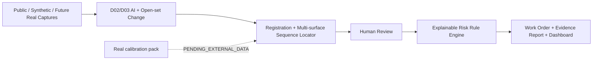

# Competition RC v1.1 材料证据包

## 答辩核心结论

1. 系统架构在 RC v1.0 基础上冻结，没有继续增加业务功能。
2. 单一 YOLO26s@640 实验真实完成，但未达到预设晋级门槛，因此保留 YOLO26n@960，体现“按规则选择而非挑结果”。
3. 失败审计定位到 D02 的 low IoU、小目标、漏检、类别失衡和 domain gap。
4. 跨 split 发现 3 组 perceptual near duplicate，作为疑似泄漏公开披露；冻结数据未修改。
5. 真实连续序列尚未获得，所有 real 指标明确 pending，不用 synthetic 冒充。

## 必须录屏/截图

- Dashboard 首屏与 System Status。
- New Case → N1/N2/N3 四面上传 → Analyze。
- 首次异常区间、trigger surface、机器证据、人工 D05 复核。
- 风险分解、工单 OPEN→IN_REVIEW→RESOLVED、Evidence Report。
- `d02-d03-detector-comparison-v1.1.md` 三模型表及 `KEEP_CURRENT_ACTIVE`。
- 5/5 稳定性 JSON、warm×10 性能摘要、17/17 验证与 5 个 real pending 场景。
- 近重复审计的 3 组路径，并注明“疑似 leakage，只报告，未改 frozen”。

## 可直接使用的数据

| 项目 | 真实结果 |
|---|---|
| Active detector | `d02-d03-yolo26n-imgsz960-v0.1` |
| Active SHA | `2dd857412b63df66d1273b326dc51afaed895da1d360c97e184762c882181a97` |
| YOLO26s smoke/train | 3 epochs PASS；100 epochs PASS，无 NaN/OOM |
| YOLO26s promotion | 0/3 提升项达到 10%；`KEEP_CURRENT_ACTIVE` |
| Candidate test | 未执行 |
| Demo stability | 5/5 PASS |
| Performance | cold 3568.115ms；warm median 914.278ms；P90 981.976ms |
| Behavior validation | 17/17 executed PASS；5 real scenarios pending |
| Real calibration | `PENDING_EXTERNAL_DATA` |

## 系统架构

## 风险表述

- 当前最大风险：未验证的真实驿站域差异，以及模型总体 AP 仍低。
- D01/D04/D05 不是 AI 自动分类。
- 风险分数不是法律责任概率；系统不做法律判责。
- 17/17 是系统行为验证，不是模型 accuracy。
